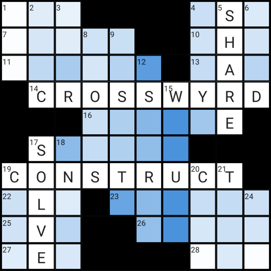

<!-- README adapted from https://github.com/othneildrew/Best-README-Template -->

<!-- PROJECT SHIELDS -->
[![Contributors][contributors-shield]][contributors-url]
[![Forks][forks-shield]][forks-url]
[![Stargazers][stars-shield]][stars-url]
[![Issues][issues-shield]][issues-url]
[![MIT License][license-shield]][license-url]


<!-- PROJECT LOGO -->
<br />
<div align="center">
  <a href="https://github.com/gasnew/crosswyrd">
    
  </a>

<h3 align="center">Crosswyrd</h3>

  <p align="center">
    The Simple Crossword Constructor
    <br />
    <a href="https://crosswyrd.app" target="_blank" rel="noreferrer"><strong>Open the App</strong></a>
    <br />
    <br />
    <a href="https://github.com/gasnew/crosswyrd/issues/new?labels=bug&template=bug-report---.md">Report Bug</a>
    ·
    <a href="https://github.com/gasnew/crosswyrd/issues/new?labels=enhancement&template=feature-request---.md">Request Feature</a>
  </p>
</div>


<!-- ABOUT THE PROJECT -->
## About The Project

<div align="center">
  <a href="https://crosswyrd.app">
    
  </a>
</div>

Crosswyrd is a web app for quickly and simply constructing, sharing, and
playing dense New York Times-style crossword puzzles.

Underlying Crosswyrd's word suggestion, auto-fill, word bank, and tile
constraint heatmap features is a [wave function collapse algorithm][wfc-url].
To learn more about how this works, you can check out [the app's original
Reddit post][reddit-post-url] and the [WFCWorker module][wfc-worker-url] that
implements the algorithm.


<!-- GETTING STARTED -->
## Getting Started

You can run Crosswyrd locally with the following instructions.

### Prerequisites

* [yarn][yarn-install-url]

### Installation

1. Clone the repo
   ```sh
   git clone https://github.com/gasnew/crosswyrd.git
   ```
2. Navigate to the `ui/` directory
   ```sh
   cd crosswyrd/ui
   ```
2. Install packages
   ```sh
   yarn install
   ```
3. Start the dev server
   ```sh
   yarn start
   ```

   After a few moments, you should be able to interact with Crosswyrd locally
   at [http://localhost:3000](http://localhost:3000).


<!-- CONTRIBUTING -->
## Contributing

Contributions are what make the open source community such an amazing place to
learn, inspire, and create. Any contributions you make are **greatly
appreciated**.

If you have a suggestion that would make this better, please fork the repo and
create a pull request. You can also simply open an issue with the tag
"enhancement." Don't forget to give the project a star. Thanks again!

1. Fork the Project
2. Create your Feature Branch (`git checkout -b feature/AmazingFeature`)
3. Commit your Changes (`git commit -m 'Add some AmazingFeature'`)
4. Push to the Branch (`git push origin feature/AmazingFeature`)
5. Open a Pull Request


<!-- LICENSE -->
## License

Distributed under the MIT License. See `LICENSE.txt` for more information.


<!-- CONTACT -->
## Contact

@gasnew on [the Crosswyrd Community Discord Server](https://discord.gg/tp3hQChd6S)


<!-- MARKDOWN LINKS & IMAGES -->
<!-- https://www.markdownguide.org/basic-syntax/#reference-style-links -->
[contributors-shield]: https://img.shields.io/github/contributors/gasnew/crosswyrd.svg?style=for-the-badge
[contributors-url]: https://github.com/gasnew/crosswyrd/graphs/contributors
[forks-shield]: https://img.shields.io/github/forks/gasnew/crosswyrd.svg?style=for-the-badge
[forks-url]: https://github.com/gasnew/crosswyrd/network/members
[stars-shield]: https://img.shields.io/github/stars/gasnew/crosswyrd.svg?style=for-the-badge
[stars-url]: https://github.com/gasnew/crosswyrd/stargazers
[issues-shield]: https://img.shields.io/github/issues/gasnew/crosswyrd.svg?style=for-the-badge
[issues-url]: https://github.com/gasnew/crosswyrd/issues
[license-shield]: https://img.shields.io/github/license/gasnew/crosswyrd.svg?style=for-the-badge
[license-url]: https://github.com/gasnew/crosswyrd/blob/master/LICENSE.txt
[screenshot]: ui/public/screenshot.png
[Next.js]: https://img.shields.io/badge/next.js-000000?style=for-the-badge&logo=nextdotjs&logoColor=white
[Next-url]: https://nextjs.org/
[React.js]: https://img.shields.io/badge/React-20232A?style=for-the-badge&logo=react&logoColor=61DAFB
[React-url]: https://reactjs.org/
[Vue.js]: https://img.shields.io/badge/Vue.js-35495E?style=for-the-badge&logo=vuedotjs&logoColor=4FC08D
[Vue-url]: https://vuejs.org/
[Angular.io]: https://img.shields.io/badge/Angular-DD0031?style=for-the-badge&logo=angular&logoColor=white
[Angular-url]: https://angular.io/
[Svelte.dev]: https://img.shields.io/badge/Svelte-4A4A55?style=for-the-badge&logo=svelte&logoColor=FF3E00
[Svelte-url]: https://svelte.dev/
[Laravel.com]: https://img.shields.io/badge/Laravel-FF2D20?style=for-the-badge&logo=laravel&logoColor=white
[Laravel-url]: https://laravel.com
[Bootstrap.com]: https://img.shields.io/badge/Bootstrap-563D7C?style=for-the-badge&logo=bootstrap&logoColor=white
[Bootstrap-url]: https://getbootstrap.com
[JQuery.com]: https://img.shields.io/badge/jQuery-0769AD?style=for-the-badge&logo=jquery&logoColor=white
[wfc-worker-url]: https://github.com/gasnew/crosswyrd/blob/master/ui/src/features/builder/WFCWorker.worker.ts
[wfc-url]: https://github.com/mxgmn/WaveFunctionCollapse
[reddit-post-url]: https://www.reddit.com/r/computerscience/comments/xh1lzi/a_dense_nytstyle_crossword_constructor_using_wave/
[yarn-install-url]: https://classic.yarnpkg.com/lang/en/docs/install
